``` mermaid
flowchart TD
    A[PR Created → Dev] --> B[Lint + Trivy Scan Workflow]
    B --> C[Comment Scan Results on PR]

    C --> D[Merge to Dev Branch]

    D --> E[Build Docker Workflow]
    E -->|Build + Push Docker Images| F[Docker Hub]
    F --> G[Trivy Scan on Docker Images]
    G --> H[Upload Scan Artifacts]
```

# DeployVerse

# Table of Contents
- [Domain Configuration](#domain-configuration)
- [Email Setup](#email-setup)
- [Google OAuth Setup](#google-oauth-setup)
- [MongoDB Setup](#mongodb-setup)
- [Environment Variables](#environment-variables)
- [Branching Strategy](#branching-strategy)
- [Deployment](#deployment)
- [Configuring Github Secrets](#configuring-github-secrets)
- [CI/CD Workflows](#cicd-workflows)
- [Terraform GitOps Workflow](#terraform-gitops-workflow)
- [Terraform Infrastructure](#terraform-infrastructure)
- [Ansible EC2 Configuration](#ansible-ec2-configuration)


Took domain from name.com
---

---
Create Hosted Zone
---


Get NS and SOA records
---


Update name.com with NS records from Route 53
---


Wait for some time to propagate the DNS changes.
---
Verify the domain is pointing to Route 53 using `dig` command.
---

```bash
dig blog.deployverse.dev NS
```


Go to resend.com and add domain **mail.deployverse.dev**
---


Get the TXT records for verification and SPF
---


Add the TXT records in name.com
---


Wait for some time to propagate the DNS changes.
---
Verify the TXT records using `dig` command.
---
```bash 
dig mail.deployverse.dev TXT
```


Go to resend.com and verify the domain.
---
Go to resend.com dashboard to get the API key to use in the application.
---


Now go to google cloud console and create a new project.
---


Go to APIs & Services and enable the Google people API.
---


Go to 0auth consent screen and configure it.
---

 select external and create.
 ---
 OAuth configuration created.

 Go to credentials and create OAuth client ID.
 Select web application and add authorized redirect URIs.
 
 

copy the client ID and client secret to use in the application.


Go to mongodb atlas and create a new cluster.


Create a new database and collection.
Get the connection string and use it in the application.


Create a .env file in the backend  root directory and add the following environment variables.

```env
PORT =
NODE_ENV =
SESSION_SECRET=
CLIENT_ID=
CLIENT_SECRET=
REDIRECT_URI=
CLIENT_URL=
SERVER_URL=
MONGO_URI =
EMAIL_API =
JWT_SECRET =
MAIL = 
```
Now you are ready to run the application.
```bash
npm install
npm run dev
```
The application will be running at http://localhost:5000

Create .env file in the frontend root directory and add the following environment variables.

```env
VITE_SERVER_URL=
```
Now you are ready to run the frontend application.
```bash
npm install
npm run dev
```
The frontend application will be running at http://localhost:5173

# Branching Strategy 
- Use `main` branch for production-ready code.
-  create dev branch from `main` and use `dev` branch for testing and integration of new features.
- Create `feature` branches from `dev` for new features or bug fixes.
- Use descriptive names for feature branches (e.g., `feature/authentication`, `bugfix/navbar-issue`).


# Deployment
- Use CI/CD pipelines to automate testing and deployment.
- Deploy `main` branch to production environment.
- Deploy `dev` branch to staging environment for testing.

# CI/CD Configuration
- Use GitHub Actions to set up pipelines.
- Create workflows for testing, building, and deploying the application.
- Ensure that tests pass before deploying to production.
- Use environment-specific configurations for different deployment environments.

## Configuring Github Secrets 
- Go to your GitHub repository and navigate to Settings > Secrets and variables > Actions.
- Go to dockerhub and create a personal access token with appropriate permissions.

- add the following secrets:
  - DOCKER_USERNAME: Your Docker Hub username.
  - DOCKER_PASSWORD: Your Docker Hub personal access token.
 
 - Go to AWS console and create SSH Key named `deployverse-key`.
 

- add the following secrets:
- EC2_SSH_KEY: The private key of the `deployverse-key` SSH key created in AWS.
- Go to AWS console and create an IAM user with programmatic access and attach the following policies:
  - AmazonEC2FullAccess
  - AmazonS3FullAccess
  - AmazonVPCFullAccess
  - IAMFullAccess
  - Route53FullAccess
  - CloudWatchFullAccess
  - CloudFontFullAccess
  - AWSACMFullAccess

- add the following secrets:
  - AWS_ACCESS_KEY_ID: The access key ID of the IAM user created in AWS.
  - AWS_SECRET_ACCESS_KEY: The secret access key of the IAM user created in AWS.

- Go to AWS S3 console and create a new bucket named `com.deployverse.terraform`.

- add the following secret:
  - TERRAFORM_BUCKET_NAME: The name of the S3 bucket created for Terraform backend.

- Go to AWS ACM console and request a public certificate for your domain `blog.deployverse.dev` .


- add the following secret:
  - BACKEND_ENV: Set all the environment variables required for the backend application.


---

 # CI/CD of App Workflow

# CI/CD Workflow -- Commit Lint Validation

## Overview

This CI/CD workflow enforces **Conventional Commit** standards on every
push to `feature/**` and `bugfix/**` branches.\
It ensures clean, readable, and automated commit message validation as
part of the development workflow.

------------------------------------------------------------------------

## Trigger Conditions

### 🔹 Runs on Push to:

-   `feature/**`
-   `bugfix/**`

------------------------------------------------------------------------

## Workflow Actions

### 1. **Check Commit Format using Commit Lint**

-   Ensures commits follow **Conventional Commit** rules.
-   If a commit fails validation → **workflow fails**.
-   Helps maintain clean commit history for CI/CD automation and
    semantic versioning.

------------------------------------------------------------------------

## GitHub Actions Workflow File

``` yaml
name: "check_commit_lint"

on:
  push:
    branches:
      - feature/**
      - bugfix/**

jobs:
  commitlint:
    runs-on: ubuntu-latest
    steps:
      - uses: actions/checkout@v4
        with:
          fetch-depth: 0

      - name: setup nodejs
        uses: actions/setup-node@v4
        with:
          node-version: lts/*

      - name: install commitlint
        run: npm install -D @commitlint/cli @commitlint/config-conventional

      - name: add commitlint config
        run: |
          echo "module.exports = { extends: ['@commitlint/config-conventional'] };" > commitlint.config.js

      - name: validate current commit
        if: github.event_name == 'push'
        run: npx commitlint --last --verbose
```

------------------------------------------------------------------------

## Benefits

-   Enforces **consistent commit style**
-   Improves readability of Git history
-   Enables **automated versioning** in future pipelines
-   Ensures clean collaboration across development teams


------------------------------------------------------------------------


1.  **Pull Request Workflow**
    → Lint, scan, and comment results
2.  **Dev Branch Merge Workflow**
    → Build Docker images, scan, and push to Docker Hub

------------------------------------------------------------------------

#  1. Pull Request Workflow -- Linting & Trivy Scanning

### **Workflow Name:** `Lint and Trivy Report`

### **Trigger:**

Runs whenever a Pull Request is opened against the **Dev** branch, and
changes occur in:

    Frontend/**
    Backend/**

------------------------------------------------------------------------

##  Purpose

This workflow ensures that all pull requests are checked for:

-   **Frontend linting** using ESLint
-   **Backend & Frontend vulnerability scanning** using Trivy
-   **PR comments** summarizing scan results
-   **Artifacts uploaded** for CI transparency

------------------------------------------------------------------------

##  Workflow Breakdown

### **1. Detect Changed Services**

Using `dorny/paths-filter`, the workflow identifies whether
**Frontend**, **Backend**, or both services were modified.

### **2. Frontend Lint + Trivy Scan**

If the Frontend changed:

-   Install dependencies
-   Run ESLint
-   Trivy filesystem scan on `Frontend/` directory
-   Upload scan results
-   Automatically comment results on the PR

### **3. Backend Trivy Scan**

If the Backend changed:

-   Run Trivy filesystem scan on `Backend/` directory
-   Upload scan results
-   Comment results on the PR

------------------------------------------------------------------------

#  2. Dev Branch Merge Workflow -- Build, Scan & Push Docker Images

### **Workflow Name:** `Build, Scan and Push Docker Images`

### **Trigger:**

Triggered when changes are pushed to the **Dev** branch inside:

    Frontend/**
    Backend/**

------------------------------------------------------------------------

##  Purpose

This workflow automates the containerization process:

-   Build **Docker images** for modified services
-   Push images to **Docker Hub**
-   Run **Trivy vulnerability scans** on images
-   Upload scan reports as artifacts

------------------------------------------------------------------------

##  Workflow Breakdown

### **1. Detect Changed Services**

Uses dorny/path-filter to find which services changed and builds only those
Docker images.

### **2. Backend Docker Build, Scan & Push**

If Backend changed:

-   Build Docker image
-   Push to Docker Hub (dev-version + latest tag)
-   Run Trivy scan on Docker image
-   Upload scan result as artifact

### **3. Frontend Docker Build, Scan & Push**

If Frontend changed:

-   Build Docker image
-   Push to Docker Hub
-   Scan built Docker image using Trivy
-   Upload scan result as artifact

------------------------------------------------------------------------

#  Summary Architecture



------------------------------------------------------------------------


## 1. Overview

This workflow covers everything that happens when work moves from the
**Dev branch → Main branch**, including:

###  On Pull Request from `dev` to `main`

-   Automatically fetch Docker **Trivy security scan results** from the
    Dev pipeline
-   Display both Backend & Frontend vulnerability details directly in
    the PR
-   Optionally block PRs that contain **CRITICAL** or **HIGH**
    vulnerability findings

###  On Merge to `main`

-   Detect semantic version bump (major/minor/patch)
-   Generate a **Git semantic version tag** (ex: `v1.4.2`)
-   Automatically create a **GitHub Release** with autogenerated
    changelog
-   Build & push production **versioned Docker images**
-   Tag release images (`vX.Y.Z` and `latest`)

###  Manual Deployment (`workflow_dispatch`)

Deploy selected image tag to: - Backend → EC2 Docker Host
- Frontend → S3 Static Hosting Bucket

------------------------------------------------------------------------

## 2. Pull Request to Main Branch --- Docker Image Security Validation

### Workflow File: `docker-scan-report-main.yml`

### Purpose

Ensures all production releases pass security checks by fetching Trivy
security scans generated in the Dev branch.

### Features

-   Fetch latest successful Dev branch Docker scan artifacts
-   Comment security details on PR
-   Highlight CRITICAL/HIGH vulnerability counts
-   Optional PR-blocking

### Flow

1.  PR opens against `main`
2.  Retrieve latest Trivy scan artifacts from Dev workflow
3.  Parse backend + frontend vulnerability reports
4.  Post results as PR comment
5.  (Optional) Block merge if severity threshold exceeded

------------------------------------------------------------------------

## 3. Merge to Main Branch --- Application Release & Versioning

### Workflow File: `create-app-release.yml`

### Purpose

Automates the process of: - Semantic versioning
- Release creation
- Docker image version tagging

### Semantic Version Rules

  Commit Pattern                            Version Bump
  ----------------------------------------- --------------
  `feat!:` / `fix!:` / `BREAKING CHANGE:`   MAJOR
  `feat:`                                   MINOR
  `fix:`                                    PATCH

If no relevant commit patterns exist → No version bump.

### Workflow Outputs

  Output             Description
  ------------------ ---------------------------------------
  `new_version`      New semantic version (e.g., `v1.5.0`)
  `version_bumped`   True/False
  `changelog`        Auto-generated release notes

### Docker Tagging

Creates:

    deployverse-backend:vX.Y.Z
    deployverse-backend:latest
    deployverse-frontend:vX.Y.Z
    deployverse-frontend:latest

------------------------------------------------------------------------

## 4. Manual Deployment --- Production Deployment Pipeline

### Workflow File: `deploy-app.yml`

### Trigger

    workflow_dispatch:
      inputs:
        tag: "Docker image tag to deploy"

### Deployment Targets

  Component   Target
  ----------- ---------------------
  Backend     EC2 Docker instance
  Frontend    S3 bucket

### Backend Deployment Steps

1.  Find EC2 instance via AWS tag
2.  Copy `.env` from GitHub secrets to server
3.  Pull Docker image tag
4.  Stop existing container
5.  Start new container with env variables & port mapping
6.  Remove unused images

### Frontend Deployment Steps

1.  Build optimized production build
2.  Clear S3 bucket
3.  Upload new build files

------------------------------------------------------------------------
<div style="page-break-after: always;"></div>

## 5. Summary Diagram


------------------------------------------------------------------------


## Deploy Application to AWS
- Runs manually using **`workflow_dispatch`**  
- Accepts 3 inputs:
  - `tag`: Docker image tag to deploy *(default: latest)*  
  - `deploy_backend`: Boolean flag to deploy backend *(default: true)*  
  - `deploy_frontend`: Boolean flag to deploy frontend *(default: true)*  

---

## Deploy Backend
 **1. deploy-backend**  
Deploys the backend container to an **EC2 instance** (if enabled).  

### Steps
1. Configure AWS credentials using **GitHub Secrets**  
2. Get EC2 instance IP — filters for instance tagged with `project=deployverse`  
3. Setup SSH access — saves and applies private key from secrets  
4. SSH into EC2 and:  
   - Write environment variables from secret `BACKEND_ENV` into `.env`  
   - Pull Docker image `${DOCKER_USERNAME}/deployverse-backend:${TAG}`  
   - Stop & remove any existing container  
   - Run a new backend container exposing port **5000**  
   - Clean up unused images older than **72h**

---

## Deploy Frontend
 **2. deploy-frontend**  
Deploys the frontend build to an **S3 bucket** (if enabled).  

### Steps
1. Checkout the repository  
2. Set up **Node.js (LTS version)**  
3. Configure **AWS credentials**  
4. Install dependencies using `npm install`  
5. Build production frontend with `npm run build` and environment variables  
6. Deploy built files (`./dist`) to the **S3 bucket (`S3_BUCKET_NAME`)**:
   - Clear old files:  
     ```bash
     aws s3 rm s3://$S3_BUCKET_NAME --recursive
     ```
   - Upload new build:  
     ```bash
     aws s3 cp ./dist s3://$S3_BUCKET_NAME --recursive
     ```
---

#  Terraform CI/CD Workflow (GitOps)

This document provides a complete overview of the GitHub Actions--based
**Terraform GitOps CI/CD pipeline** used for validating, releasing, and
deploying infrastructure changes stored inside the
`Infrastructure/terraform` directory.

The CI/CD process is split into three major workflows:

1.  **Pull Request Validation** → Lint, validate, security scan, and
    plan.
2.  **Automated Release Generation** → Semantic versioning, packaging,
    tagging, changelog, upload to S3.
3.  **Infrastructure Deployment** → Deploy selected version of
    infrastructure using Terraform apply/destroy.

------------------------------------------------------------------------

#  1. Terraform CI Workflow (Pull Request Validation)

### **Workflow Name:** `Terraform CI Workflow`

### **Trigger:**

Runs when a Pull Request targets the **Dev** branch and includes changes
under:

    Infrastructure/terraform/**

## Purpose

This workflow ensures that **every infrastructure change is validated
before merging**:

-   Terraform initialization & validation
-   TFLint scanning
-   Security scanning via Trivy
-   Terraform plan generation
-   PR comment with plan + security results
-   Artifacts upload

------------------------------------------------------------------------

#  2. Create Terraform Release Workflow

### **Workflow Name:** `Create Terraform Release`

### **Trigger:**

Runs on **push to main branch** if files under:

    Infrastructure/terraform/**

## Purpose

This workflow automatically creates **versioned infrastructure
releases** using semantic versioning and pushes them to Amazon S3.

------------------------------------------------------------------------

#  3. Deploy Terraform Infrastructure Workflow

### **Workflow Name:** `Deploy Terraform Infrastructure`

### **Trigger:**

Manually triggered (`workflow_dispatch`).

## Purpose

Allows controlled deployment of a selected infrastructure version using
Terraform apply/destroy.

------------------------------------------------------------------------

#  Summary Architecture


------------------------------------------------------------------------

---

# Creating Infrastructure Using Terraform

## Project Overview

This project provisions cloud infrastructure on AWS using Terraform.\
It covers backend configuration, network creation, EC2 provisioning,
CloudFront distribution setup, Route 53 DNS records, and SSL
certificates through ACM.

------------------------------------------------------------------------

## Key Components

### 1. S3 Bucket for Terraform Backend

-   Stores Terraform state securely.
-   Enables remote backend and state locking.

### 2. IAM Role for Terraform

-   Grants permissions to manage AWS resources.
-   Attached to EC2 or used with Terraform Cloud/GitHub Actions.

### 3. Security Group for EC2

-   Allows required inbound ports (SSH, HTTP, HTTPS, Custom app ports).
-   Restricts outbound as needed.

### 4. EC2 Instance Setup

-   Launches an EC2 instance.
-   Attaches IAM role & security group.
-   Deploys application or monitoring stack (Grafana, Prometheus,
    backend API).

### 5. CloudFront Distribution

-   Points to S3 bucket origin.
-   Uses ACM SSL certificate.
-   Provides global CDN caching.

### 6. Route 53 DNS Records

-   Maps domain/subdomain to CloudFront.
-   Creates A/CNAME records for:
    -   API Server
    -   Prometheus
    -   Grafana

### 7. VPC + Subnets + IGW + Route Tables

-   Custom VPC for controlled networking.
-   Subnets for EC2 placement.
-   Internet Gateway for outbound traffic.
-   Route tables for subnet routing.

### 8. ACM Certificate

-   Issues SSL certificate for domain/subdomains.
-   Used by CloudFront and application endpoints.

------------------------------------------------------------------------

## Terraform Code Structure

### Data Lookups

``` hcl
data "aws_route53_zone" "hosted_zone" {
  name = var.hosted_zone_name
}

data "aws_acm_certificate" "frontend_cert" {
  domain      = "blog.deployverse.dev"
  statuses    = ["ISSUED"]
  most_recent = true
}
```

------------------------------------------------------------------------

## VPC Module

``` hcl
module "vpc" {
  source            = "./modules/vpc"
  cidr_block        = var.cidr_block
  subnet_cidr_block = var.subnet_cidr_block
}
```

------------------------------------------------------------------------

## EC2 Module

``` hcl
module "ec2" {
  source        = "./modules/ec2"
  Name          = var.project
  Creator       = var.Creator
  ami_id        = var.ami_id
  instance_type = "t2.micro"
  subnet_id     = module.vpc.subnet_id
  vpc_id        = module.vpc.vpc_id
  key_name      = var.key_name
}
```

------------------------------------------------------------------------

## S3 Module

``` hcl
module "s3" {
  source             = "./modules/s3"
  bucket_name        = var.bucket_name
  cloudfront_cdn_arn = module.cloudfront.cloudfront_cdn_arn
}
```

------------------------------------------------------------------------

## CloudFront Module

``` hcl
module "cloudfront" {
  source              = "./modules/cloudfront"
  bucket_name         = var.bucket_name
  region              = var.region
  default_root_object = "index.html"
  alias_name          = var.frontend_domain_name
  acm_certificate_arn = data.aws_acm_certificate.frontend_cert.arn
  price_class         = var.price_class
  Creator             = var.Creator

  bucket_domain_name = module.s3.bucket_domain_name
}
```

------------------------------------------------------------------------

## Route 53 -- CloudFront

``` hcl
module "route53_cf" {
  source         = "./modules/route53"
  hosted_zone_id = data.aws_route53_zone.hosted_zone.zone_id
  domain_name    = var.frontend_domain_name

  use_alias              = true
  alias_name             = module.cloudfront.cloudfront_cdn_domain_name
  alias_zone_id          = module.cloudfront.cloudfront_cdn_hosted_zone_id
  evaluate_target_health = false

  record_type = "CNAME"
  ttl         = 300
  records     = []
}
```

------------------------------------------------------------------------

## Route 53 -- EC2 API Server

``` hcl
module "route53_ec2" {
  source         = "./modules/route53"
  hosted_zone_id = data.aws_route53_zone.hosted_zone.zone_id
  domain_name    = var.backend_domain_name

  use_alias = false
  evaluate_target_health = false

  record_type = "A"
  records     = [module.ec2.public_ip]
  ttl         = 300

  depends_on = [module.ec2]
}
```

------------------------------------------------------------------------

## Route 53 -- Grafana

``` hcl
module "route53_grafana" {
  source         = "./modules/route53"
  hosted_zone_id = data.aws_route53_zone.hosted_zone.zone_id
  domain_name    = var.grafana_domain_name

  use_alias = false

  evaluate_target_health = false

  record_type = "A"
  records     = [module.ec2.public_ip]
  ttl         = 300

  depends_on = [module.ec2]
}
```

------------------------------------------------------------------------

## Route 53 -- Prometheus

``` hcl
module "route53_prometheus" {
  source         = "./modules/route53"
  hosted_zone_id = data.aws_route53_zone.hosted_zone.zone_id
  domain_name    = var.prometheus_domain_name

  use_alias = false

  evaluate_target_health = false

  record_type = "A"
  records     = [module.ec2.public_ip]
  ttl         = 300

  depends_on = [module.ec2]
}
```

------------------------------------------------------------------------

## Deliverables

-   S3 backend for Terraform
-   IAM role with required permissions
-   VPC, subnets, IGW, route tables
-   EC2 instance (backend, Grafana, Prometheus)
-   CloudFront distribution with ACM SSL
-   Route 53 DNS records for frontend, backend, Grafana, Prometheus

------------------------------------------------------------------------


# Configuring an EC2 Server Using Ansible

### Roles: Docker, Monitoring, Nginx

## Project Overview

This project automates the setup and configuration of an Amazon EC2
instance using Ansible.
It implements three major components:

1.  **Docker Role** -- Installs Docker and prepares the environment for
    containerized applications
2.  **Monitoring Role** -- Deploys Prometheus & Grafana for monitoring
3.  **Nginx Role** -- Configures Nginx as a reverse proxy with SSL using
    Certbot

------------------------------------------------------------------------

## Architecture Diagram (High-Level)

                        ┌───────────────┐
                        │     Clients    │
                        └───────┬───────┘
                                │ HTTPS
                        ┌───────▼────────┐
                        │     Nginx       │
                        │ Reverse Proxy   │
                        └───────┬────────┘
                                │ HTTP
                ┌───────────────┴────────────────┐
                │         Backend App (Docker)    │
                └─────────────────────────────────┘

                ┌─────────────────────────────────┐
                │   Prometheus (Monitoring)       │
                └─────────────────────┬───────────┘
                                      │ Metrics
                ┌─────────────────────▼───────────┐
                │          Grafana                 │
                │     Metrics Visualization        │
                └──────────────────────────────────┘

------------------------------------------------------------------------

## Role Descriptions

### 1. Docker Role

-   Install Docker engine
-   Enable/start Docker service
-   Add user to docker group


------------------------------------------------------------------------

### 2. Monitoring Role

#### Prometheus

-   Create Prometheus directory
-   Copy prometheus.yml config
-   Deploy Prometheus container
-   Configure scraping targets
-   Persistent volume

#### Grafana

-   Deploy Grafana container
-   Set admin password
-   Persist data
-   Connect Prometheus as datasource

#### Loki
- Deploy Loki container
- Deploy Promtail container for log shipping
- Configure Promtail to scrape container logs (backend, Grafana, Loki)
- Configure persistent volume for Loki data

#### Alertmanager
- Deploy Alertmanager container
- Copy alertmanager.yml config
- Configure Slack receiver for notifications
- Configure persistent volume for data

------------------------------------------------------------------------

### 3. Nginx Role

-   Install Nginx
-   Configure reverse proxy
-   Create virtual host
-   Restart Nginx

------------------------------------------------------------------------

### 4. SSL Setup with Certbot

-   Install Certbot
-   Generate Let's Encrypt certificates
-   Enable HTTPS in Nginx
-   Auto-renew certificates

------------------------------------------------------------------------

## Example Playbook

``` yaml
- hosts: ec2_server
  become: yes
  roles:
    - docker
    - monitoring
    - nginx
```

------------------------------------------------------------------------

## SSL Renewal Automation

    0 3 * * * certbot renew --quiet

------------------------------------------------------------------------

## Deliverables

-   Fully configured EC2 server
-   Dockerized backend app
-   Prometheus + Grafana monitoring
-   Nginx reverse proxy
-   SSL with auto-renewal


